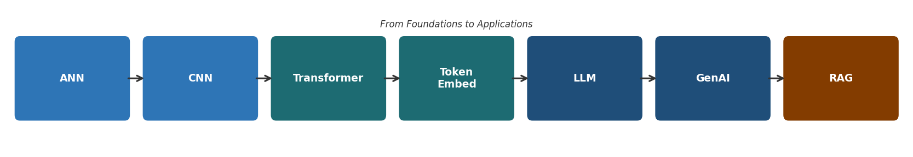
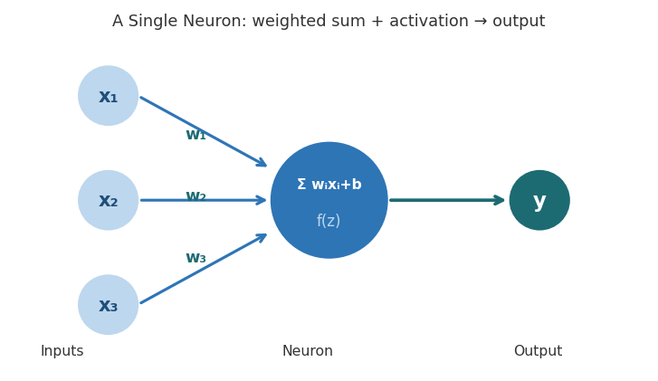
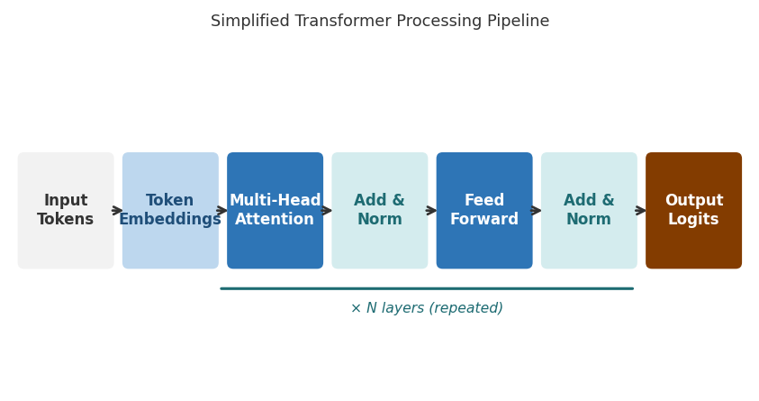
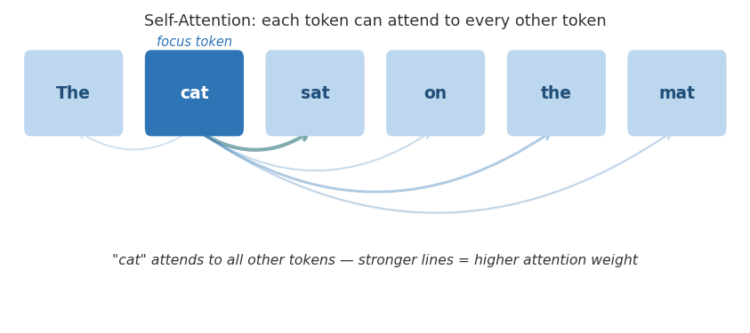
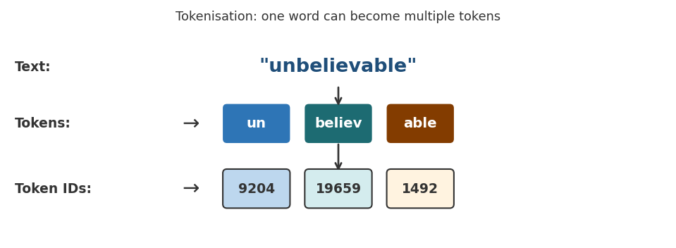
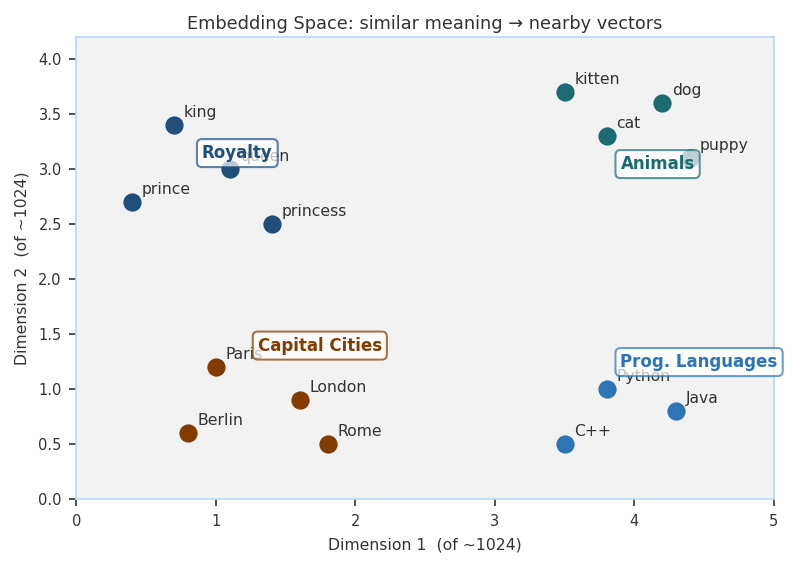
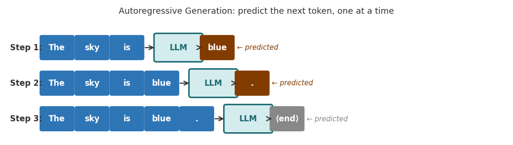
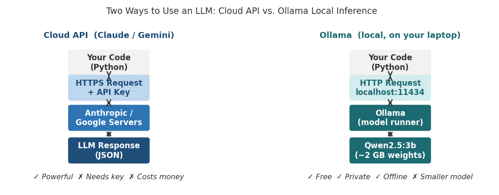
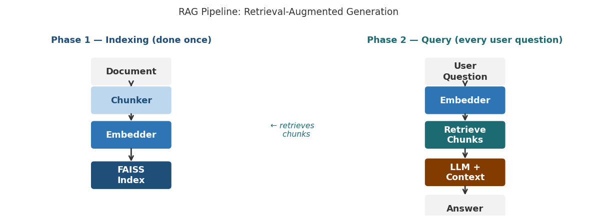
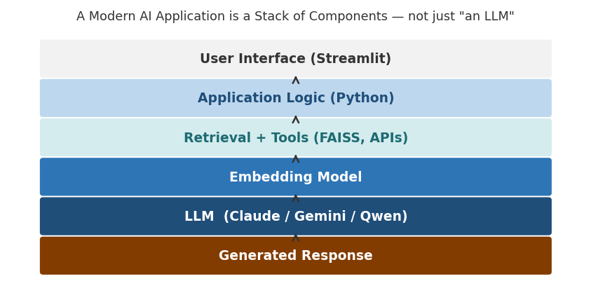

*AI-Assisted Software Development · Atlas University · Fall 2026–2027*

*Week 1 Pre-Reading · Prof. Dr. Vedat Coşkun*

# Technical Background: Modern AI · LLMs · Generative AI

ANN · CNN · Transformer · Embeddings · LLM · GenAI · Local Inference · RAG

### 📖 How to use this document

Read this before you attend the first class. The in-class lecture will be a 20-minute summary of exactly this material — so if you arrive having read it once, you will follow immediately. You are not expected to memorise formulas or to understand every detail on first reading. Your goal is to build a working mental model of how modern AI systems are assembled from components.

This is one of three pre-reading documents. "Development Environment and Tools" (Doc 3) covers the development environment and every tool you will use this term: Python, VS Code, GitHub, Streamlit, the Claude and Gemini APIs, Ollama, FAISS, pytest, Ragas, Selenium and the rest. "Working with AI Tools" (Doc 4) covers the same tools as products: what they cost, how they ration you, and the working habits that keep them affordable. Read all three before the first session. This document is about the ideas; Doc 3 is about the setup; Doc 4 is about the money and the habits.

## 1. Why Do You Need This Background?

Modern AI applications — ChatGPT, coding assistants, document Q&A systems, AI-assisted software development tools — are not single algorithms. They are systems assembled from several specialised components. You do not need to become a deep-learning researcher, but you do need to understand what each component does, why it exists, what goes in, and what comes out — because in this course you will be building exactly these systems.

The figure below shows the conceptual progression this document follows — from the neural network foundation to the full application stack you will build in this course.



*Figure 1 — From foundational architectures to modern AI applications*

## 2. Artificial Neural Networks (ANN)

An Artificial Neural Network (ANN) is a computational model inspired loosely by biological neural networks. It consists of layers of interconnected units called neurons. Each neuron applies a weighted sum to its inputs followed by an activation function.



*Figure 2 — A single neuron applies a weighted sum then an activation function*

### What does a neuron compute?

```
z = Σ wᵢxᵢ + b y = f(z)
```

xᵢ is an input value, wᵢ is a learned weight, b is a bias, and f(·) is an activation function such as ReLU, sigmoid, or GELU. The important point: the network learns the weights from data — you do not write them by hand.

### How does an ANN learn?

During training the network makes predictions, compares them with correct answers, computes a loss, and uses backpropagation to calculate how each weight should change. An optimiser (gradient descent or Adam) then updates the weights. This cycle repeats many times across a large dataset.

- Feed training data → make a prediction → measure the loss → backpropagate → update weights → repeat.

## 3. Convolutional Neural Networks (CNN)

A standard ANN can process any structured input, but images have a specific property: nearby pixels are strongly related. CNNs exploit this by using small learned filters that slide across the image and detect local patterns.

### What does a CNN learn?

- Early layers — edges, corners, simple textures

- Middle layers — curves, shapes, local patterns

- Deep layers — object parts and high-level concepts

CNNs are the dominant architecture for computer vision tasks. You will not build CNNs in this course, but understanding them helps you appreciate why a general ANN was not enough — and why a different specialisation was later needed for language.

## 4. Why Transformers?

Language is different from images. Words depend on other words that may be far away in a sentence. Earlier architectures processed text step-by-step (recurrent networks), which made it hard to capture long-range relationships and slow to train in parallel.

The Transformer architecture (Vaswani et al., 2017 — "Attention Is All You Need") replaced the sequential step with an attention mechanism that lets every position in a sequence look at every other position simultaneously. This single change enabled the modern LLM era.

> **"Attention Is All You Need" — Vaswani et al., NeurIPS 2017. If you read one AI paper in your life, read this one. Sections 1 and 3 are sufficient for this course.**



*Figure 3 — Simplified Transformer pipeline: tokens flow through attention and feed-forward layers, repeated N times*

## 5. Self-Attention

Self-attention is the core operation of the Transformer. It allows each token in a sequence to attend to — that is, to be influenced by — any other token in the same sequence.

### Query, Key, and Value

For each token, the attention mechanism constructs three vectors: a Query (Q), a Key (K), and a Value (V). A helpful analogy: imagine searching a library. The query describes what you are looking for. Each book has a key describing its topic. The value is the book's actual content. Attention scores how well your query matches each key, then retrieves a weighted combination of values.

```
Attention(Q, K, V) = softmax(QKᵀ / √dₖ) · V
```

You do not need to memorise this formula. The key intuition: attention computes which pieces of information should influence each other, and by how much.



*Figure 4 — "cat" attends to all other tokens; thicker lines indicate higher attention weight*

### Multi-Head Attention

In practice, Transformers run multiple attention operations in parallel (called "heads"). Each head can learn a different kind of relationship — one might track grammatical agreement, another might track topic reference. Their outputs are combined.

## 6. Tokens and Tokenisation

Before a language model can process text, the text must be converted into tokens. A token is not necessarily a complete word. Depending on the tokeniser, a word may become one token or several subword pieces.

- The word "unbelievable" might become ["un", "believ", "able"] — three tokens.

- Short common words like "the" or "is" are typically one token each.

- Numbers and special characters are tokenised in model-specific ways.



*Figure 5 — "unbelievable" splits into 3 tokens, each mapped to a numerical ID*

After tokenisation, each token is mapped to a numerical ID. The model never sees raw text — it sees sequences of integers. This is the input to the Transformer.

## 7. Embeddings

An embedding is a learned numerical vector that represents an object — a word, a sentence, a document, an image, or a piece of code — in a high-dimensional space.

```
"Artificial intelligence is powerful." → [0.21, −0.17, 0.83, …, 0.42] (1024 numbers)
```

### Why are embeddings important?



*Figure 6 — Similar concepts cluster together in embedding space (2 of ~1024 dimensions shown)*

Embeddings encode meaning, not just spelling. Two sentences with the same meaning but different words will have similar embeddings — their vectors will point in roughly the same direction in the high-dimensional space. This enables:

- Semantic search — find documents by meaning, not by keyword

- Recommendation systems

- Document retrieval for RAG pipelines

- Clustering and duplicate detection

### Measuring similarity

Once texts are represented as vectors, similarity is measured using cosine similarity — comparing the direction of two vectors rather than their magnitude. A high cosine similarity means the two texts have similar meaning.

```
cos(θ) = (A · B) / (|A| · |B|)
```

### Embedding models vs LLMs

An embedding model and an LLM are different tools. An embedding model converts text into a vector for retrieval. An LLM generates new text. In a RAG system you use both: the embedding model finds relevant documents, the LLM generates the final answer.

|                     | Embedding Model                 | LLM                   |
| ------------------- | ----------------------------------- | ------------------------- |
| **Primary purpose** | Represent meaning for retrieval     | Generate language         |
| **Output**          | A vector of numbers                 | Tokens / text             |
| **Typical use**     | Semantic search, RAG retrieval step | Chat, code, summarisation |

## 8. Large Language Models (LLMs)

A Large Language Model (LLM) is a Transformer-based model trained on a very large collection of text and/or code. It learns a probability distribution over what token is likely to come next, given everything that came before.

### How does an LLM generate text?

LLMs generate text autoregressively: predict the next token, append it, predict again, repeat until a stopping condition is met. The model does not write a full sentence at once — it writes one token at a time, each time conditioning on everything before it.

Which token is selected? The model outputs a probability distribution over its entire vocabulary. Depending on the sampling strategy (temperature, top-p), the selected token may be the most probable one or a sample from the distribution.



*Figure 7 — Each step the LLM predicts the next token; the prediction is appended and the process repeats*

### Training vs. inference

Training an LLM — learning its billions of parameters on massive datasets — costs millions of dollars and takes weeks on thousands of specialised chips. In this course you will only do inference: sending prompts and receiving responses using models that someone else has already trained.

|                    | Training                         | Inference                 |
| ------------------ | ------------------------------------ | ----------------------------- |
| **Purpose**        | Learn model parameters               | Use learned parameters        |
| **Input**          | Very large datasets                  | Your prompt                   |
| **Main operation** | Repeated optimisation (backprop)     | Forward pass + token sampling |
| **Typical cost**   | Extremely high (millions of dollars) | Much lower — cents per call   |

## 9. Context Windows, System Prompts and Sampling

Three practical controls shape what an LLM does with your request. You will use all three every week of this course.

### The context window

An LLM has no memory between calls. Everything it knows about the current conversation must be sent again, every time: the system prompt, the full conversation history, any retrieved documents, and the new question. The context window is the maximum number of tokens this bundle may contain.

This is the single most important practical constraint in LLM application design. Long chats eventually exceed it. Large documents cannot simply be pasted in. Both problems have the same answer: send less, but send the right part — which is exactly what RAG does.

> **The model does not "remember" your earlier messages. Your application re-sends them. If you do not send them, they never happened.**

### The system prompt

A system prompt is a separate instruction that sets the model's role and rules before the user says anything. "You are a legal assistant. Answer only from the provided documents. If the answer is not in them, say you do not know." — that is a system prompt, and it changes the model's behaviour far more than politely asking in the user message.

Writing good system prompts is a real engineering skill, and it is the difference between an application that behaves predictably and one that does not. You will write and compare several of them in Week 3.

### Temperature and sampling

At each step the model produces a probability distribution over its vocabulary. How a token is picked from that distribution is your choice. A low temperature makes the model pick high-probability tokens almost every time — repeatable and conservative. A high temperature flattens the distribution, producing more varied and more surprising output.

- Low temperature (0–0.3) — factual answers, code, structured output, anything you want reproducible.

- High temperature (0.7–1.0) — brainstorming, creative writing, generating alternatives.

If you ask the same question twice and get different answers, this is why. It is not a malfunction.

## 10. Generative AI

Generative AI (GenAI) is the broad category of AI systems that can generate new content. An LLM is one important type of GenAI, but the category is wider:

- Text and code — LLMs (Claude, Gemini, GPT-4, Qwen)

- Images — diffusion models (Stable Diffusion, DALL·E, Midjourney)

- Audio — speech synthesis, music generation

- Video — emerging video generation models

In this course you will work with text and code generation — specifically with Claude, Gemini, and Ollama-hosted models. Understanding that GenAI is a broader landscape helps you put the tools you are using into context.

## 11. Running Models Locally: Ollama and Qwen

So far everything described here runs on somebody else's computer. When you call Claude or Gemini, your text travels over the internet to a data centre, a very large model processes it there, and the answer comes back. That is cloud inference: powerful, but it needs an API key, it costs money per call, and your data leaves your machine.

There is another option. A smaller model can run on your own laptop, with no internet connection and no API key. Ollama is the program that makes this practical: you install it once, download a model, and it exposes a local server at localhost:11434 that your Python code talks to exactly as it would talk to a cloud API.



*Figure 10 — The same Python code, two very different paths: cloud API versus local inference*

### Qwen

Qwen is a family of open-weight language models developed by Alibaba's Qwen team. "Open-weight" means the trained parameters are published, so anyone may download and run them. Qwen is not a new architecture — it is a Transformer, exactly as described earlier in this document. You will use Qwen models through Ollama.

### Why a 3-billion-parameter model fits on a laptop

A model with 3 billion parameters, stored at full precision, would need roughly 12 GB of memory. Most laptops cannot spare that. Quantisation solves the problem: each parameter is stored using fewer bits — typically 4 instead of 32 — which shrinks the model to around 2 GB at a small cost in quality. Every model you download through Ollama is quantised by default.

This is why model size matters to you personally. Pick the largest model your machine can hold in memory — the same rule appears in Doc 4 and on the Week 1 slides:

- 16 GB RAM or more — qwen2.5:7b (about 4.7 GB on disk). This is the size the course assumes

- 8 to 16 GB RAM — qwen2.5:3b (about 1.9 GB)

- 4 to 8 GB RAM — qwen2.5:1.5b (about 1 GB)

- Less than 4 GB — qwen2.5:0.5b (about 0.4 GB)

No graphics card is required. On a modern CPU a 3B model produces roughly 5 to 15 tokens per second — fast enough for short answers, slow enough that you will feel it on long ones. In Week 3 you will measure this yourself on two different model sizes and write down what you observe.

### Which should you use?

Neither is simply better. A cloud model gives you far more capability; a local model gives you privacy, zero cost, and offline operation. Real applications often use both — a local model for routine work and a cloud model for the hard cases. In this course your chatbot will support both behind a single interface, and switching between them will be one line of code.

|                    | Cloud API       | Ollama (local)           |
| ------------------ | ------------------- | ---------------------------- |
| **Runs on**        | Provider servers    | Your laptop                  |
| **Needs internet** | Yes                 | No                           |
| **API key**        | Required            | Not required                 |
| **Cost**           | Per call            | Free after download          |
| **Your data**      | Leaves your machine | Never leaves                 |
| **Capability**     | Much higher         | Smaller model, lower quality |

## 12. Hallucination

> **An LLM can generate a confident-sounding statement that is factually incorrect. This is called a hallucination.**

The model is not lying — it does not have intentions. It is generating text according to learned patterns and the current context. It has no mechanism to automatically verify every claim against an authoritative source.

This has direct consequences for software engineering. Any system that relies on LLM output for decisions must be designed with this limitation in mind. In this course, the ai_log.md you submit every week asks you to evaluate what the AI got wrong and what you corrected — that is the professional discipline this course is training you in.

## 13. Retrieval-Augmented Generation (RAG)

The core limitation of a standalone LLM: it can only work with what it learned during training plus what you put in the current prompt. It cannot access private documents, a company's internal database, or information added after its training cutoff.

RAG solves this by adding a retrieval step before generation:

- Documents are split into chunks and converted into embeddings.

- The embeddings are stored in a vector database (or an in-memory index like FAISS).

- When a user asks a question, the question is also converted into an embedding.

- The most similar document chunks are retrieved.

- The retrieved chunks are given to the LLM as context in the prompt.

- The LLM generates an answer grounded in the retrieved content.



*Figure 8 — RAG has two phases: indexing (done once) and querying (every user question)*

### Why does RAG help?

Without RAG, an LLM relies only on training knowledge. With RAG, you can supply current, private, or domain-specific information at inference time — without retraining the entire model. In Week 6 of this course you will build a RAG pipeline from scratch.

## 14. The Modern AI Application Stack

A key misconception among beginners is treating a model as if it were the complete application. In practice, a production AI application looks more like:

```
User Interface → Application Logic → Retrieval + Tools → Embedding Model + Vector Index → LLM → Response
```

The model is one component in a larger software system — and designing that system is exactly the engineering challenge this course addresses.



*Figure 9 — A modern AI application is a stack of components; the LLM sits in the middle, not at the top*

| Architecture | Main Strength                              | Typical Use               |
| ---------------- | ---------------------------------------------- | ----------------------------- |
| **ANN**          | General nonlinear relationships                | Tabular / structured data     |
| **CNN**          | Local and hierarchical spatial patterns        | Images, computer vision       |
| **Transformer**  | Relationships across sequences using attention | Language, code, multimodal AI |

## 15. Summary: Concepts to Know Before Class

After reading this document you should be able to explain each of the following in one or two sentences. If you cannot, re-read the relevant section.

| Concept        | Key Idea                                                                                                    |
| ------------------ | --------------------------------------------------------------------------------------------------------------- |
| **ANN**            | A general neural-network foundation that learns relationships through trainable weights and biases.             |
| **CNN**            | A neural architecture that uses local filters to learn hierarchical spatial features — ideal for images.        |
| **Transformer**    | An attention-based architecture that models relationships among all elements of a sequence in parallel.         |
| **Token**          | The smallest unit a language model processes. Words can be split into multiple tokens by the tokenizer.         |
| **Embedding**      | A learned numerical vector that places semantically similar items close together in high-dimensional space.     |
| **LLM**            | A large Transformer-based model trained on vast text data; generates the next token, one at a time.             |
| **Generative AI**  | A broad class of AI systems that produce new content — text, code, images, audio, video.                        |
| **Hallucination**  | When an LLM generates a confident-sounding statement that is factually incorrect.                               |
| **RAG**            | Retrieval-Augmented Generation: retrieve relevant documents, supply them as context, then generate.             |
| **Context window** | The maximum number of tokens one request may contain — system prompt, history, documents and question together. |
| **System prompt**  | A separate instruction that sets the model's role and rules before the user speaks.                             |
| **Temperature**    | Controls how adventurously the next token is sampled. Low = repeatable, high = varied.                          |
| **Quantisation**   | Storing parameters with fewer bits so a large model fits in ordinary memory, at a small cost in quality.        |
| **Ollama**         | A program that runs open-weight models locally on your own machine — no API key, no internet, no cost.          |

### Where These Concepts Appear in the Course

Nothing in this document is theory for its own sake. Every concept here becomes something you build, measure or debug in a specific week.

| Concept                                      | Week       | Where you meet it                                          |
| ------------------------------------------------ | -------------- | -------------------------------------------------------------- |
| **Transformers, attention, tokens**              | **Week 1**     | Conceptual foundation — lecture and this document              |
| **System prompts, context window, temperature**  | **Week 3**     | Written and compared in your chatbot                           |
| **Local inference — Ollama, Qwen, quantisation** | **Week 3**     | Installed, measured, and benchmarked on your own machine       |
| **Embeddings and cosine similarity**             | **Weeks 3, 6** | Similarity experiment, then document retrieval                 |
| **LLM API integration**                          | **Week 5**     | The core AI feature of your own project                        |
| **Retrieval-Augmented Generation**               | **Week 6**     | Built from scratch — chunking, indexing, retrieval, generation |
| **Hallucination and verification**               | **Every week** | ai_log.md; measured with Ragas in Week 9                      |
| **AI ethics and human-in-the-loop**              | **Week 11**    | Security audit and responsible-use review                      |

### 💬 Before You Come to Class — Reflection Questions

You do not need to write formal answers. Think about these questions so you arrive with something to say and ask.

- What is the difference between training a model and using (inferring with) a model? Why does this distinction matter for you as an application developer?

- Why can a Transformer capture the relationship between the first and last word of a long sentence better than a recurrent network?

- A friend says "ChatGPT is just an LLM." What would you add or correct after reading this document?

- You are building a Q&A assistant for Turkish law. Why might a plain LLM give unreliable answers? How would adding RAG improve the situation?

- An LLM writes a confident explanation of a legal precedent that does not exist. Is the model broken? Who is responsible for catching this in a production system?

- Your application must process confidential student records. Would you send them to a cloud API or run a local model? What do you gain, and what do you give up?

### References

- Vaswani et al., "Attention Is All You Need," NeurIPS 2017. https://arxiv.org/abs/1706.03762

- Alammar, J., "The Illustrated Transformer," 2018. https://jalammar.github.io/illustrated-transformer

- Karpathy, A., "Intro to Large Language Models," YouTube, 2023. https://youtu.be/zjkBMFhNj_g — watch the first 30 minutes

- Brown et al., "Language Models are Few-Shot Learners" (GPT-3), NeurIPS 2020. https://arxiv.org/abs/2005.14165 — read the abstract and Section 1

- Ji et al., "Survey of Hallucination in Natural Language Generation," ACM Computing Surveys, 2023. https://arxiv.org/abs/2202.03629 — Sections 1–3

- Lewis et al., "Retrieval-Augmented Generation for Knowledge-Intensive NLP Tasks," NeurIPS 2020. https://arxiv.org/abs/2005.11401 — Sections 1–2

- Qwen Team, "Qwen3 Technical Report," 2025. https://arxiv.org/abs/2505.09388 — optional background

*This document covers the concepts. "Development Environment and Tools" (Doc 3) covers the environment and the tool set; "Working with AI Tools" (Doc 4) covers prices, limits and working habits — read all three before the first session.*
